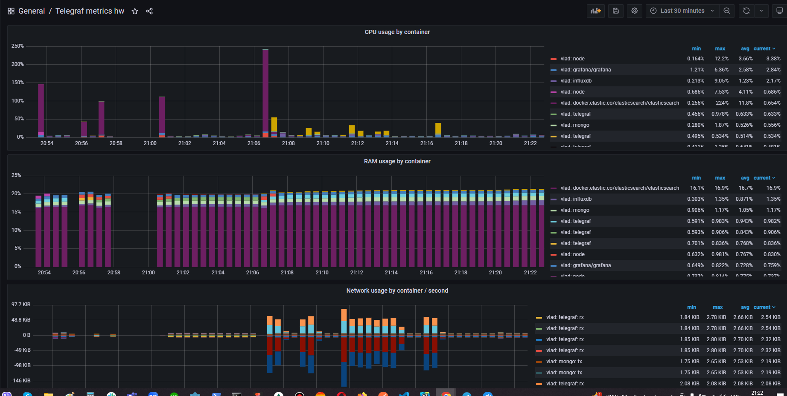
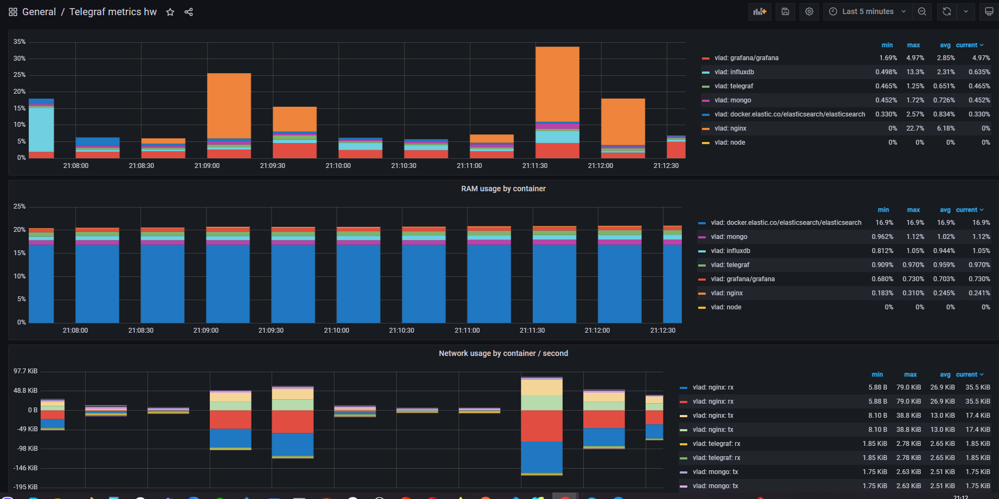
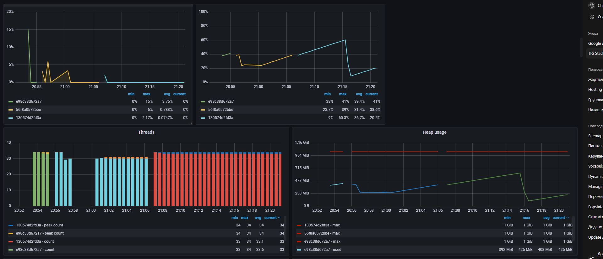
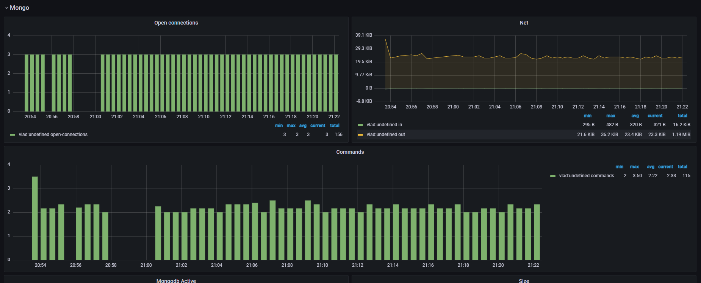
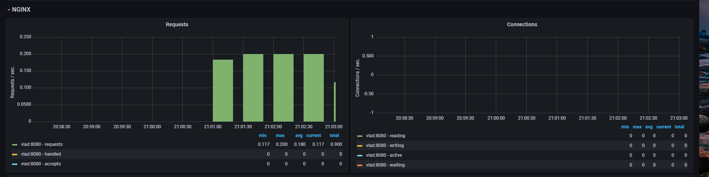
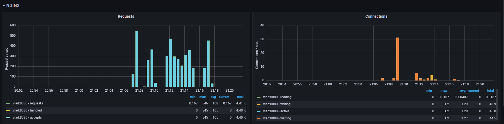
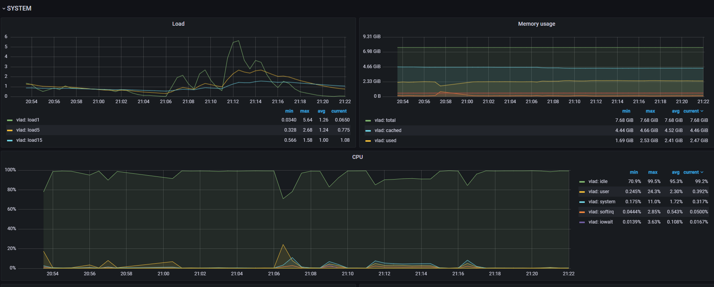

# Example Docker Compose project for Telegraf, InfluxDB and Grafana

This an example project to show the TIG (Telegraf, InfluxDB and Grafana) stack.

## Docker



## Elasticsearch


## Mongo


## NGINX



## System


## Start the stack with docker compose

```bash
$ docker-compose up
```

## Services and Ports

### Grafana
- URL: http://localhost:3000 
- User: admin 
- Password: admin 

### Telegraf
- Port: 8125 UDP (StatsD input)

### InfluxDB
- Port: 8086 (HTTP API)
- User: admin 
- Password: admin 
- Database: influx

## Generate Load
```
cd scripts
run load.sh
Killed by Ctrl+C
```
